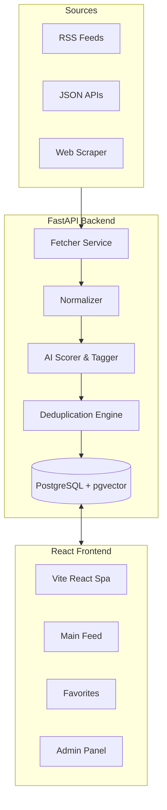

# AI News Dashboard

An intelligent news aggregation and broadcasting platform powered by FastAPI, React, PostgreSQL (`pgvector`), and Google Gemini. Built to automatically hunt for stories, semantically deduplicate them, score their impact, and queue them for omni-channel broadcasting.

## System Architecture



## Setup and Testing Guide

This section explains how to spin up the AI News Dashboard, both via Docker (recommended) and natively on your local machine, and how to run the backend verification tests.

### Strategy 1: The "One-Click" Docker Method (Recommended)

Because this project relies on PostgreSQL with the `pgvector` extension, running via Docker Compose is the fastest and most reliable way to evaluate the application.

**Prerequisites:** 
- Docker and Docker Compose installed.

**Steps:**
1. Open a terminal in the root of the project (`culinda-ai-news`).
2. Create your environment file:
   - Duplicate `.env.example` in the root folder and rename it to `.env`.
   - Add your Gemini API key: 
     ```env
     GEMINI_API_KEY=your_gemini_api_key_here
     POSTGRES_USER=postgres
     POSTGRES_PASSWORD=postgres
     POSTGRES_DB=news_db
     ```
   - To test actual Email broadcasts, add your SMTP credentials (like a Gmail App Password):
     ```env
     SMTP_EMAIL=your_email@gmail.com
     SMTP_PASSWORD=your_app_password
     ```
3. Build and launch the stack:
   ```bash
   docker-compose up --build
   ```
4. Access the application:
   - **Frontend UI:** http://localhost:3000
   - **Backend API (Swagger):** http://localhost:8000/docs
   
*(Note: On the first database spin-up, Alembic migrations apply automatically, and `seed.py` will load the 20 initial news sources into the database.)*

### Strategy 2: Natively running Backend & Frontend separately

If you prefer to run the applications outside of Docker containers (for active development), follow these steps.

**Prerequisite:** You still must have a PostgreSQL instance running locally with the `pgvector` extension enabled.

#### 1. Start the Backend

Open a terminal specifically for the backend:

```bash
cd backend
python -m venv venv

# Windows:
venv\Scripts\activate
# Mac/Linux:
source venv/bin/activate

# Install dependencies
pip install -r requirements.txt

# Run migrations to build the tables and pgvector extension
alembic upgrade head

# Start the FastAPI server
uvicorn app.main:app --reload --port 8000
```
Backend will be live at `http://localhost:8000`.

#### 2. Start the Frontend

Open a **new** separate terminal for the frontend:

```bash
cd frontend

# Install Node dependencies
npm install

# Start the Vite development server
npm run dev
```
Frontend will be live at `http://localhost:3000` (or `http://localhost:5173` depending on your Vite setup). It is already configured to proxy `/api` calls to `localhost:8000`.

## How to Test the Project

The backend contains a `pytest` suite that verifies the core ingestion pipeline logic, particularly the Deduplication and Normalizer systems.

To run the tests, open a terminal in the `backend` folder where your python virtual environment is activated:

```bash
# 1. Install test dependencies
pip install -r requirements-test.txt

# 2. Run the pytest suite
pytest -v
```

This will automatically discover and execute the tests located in the `tests/` directory (e.g., `test_dedup.py`, `test_normalizer.py`). 

A successful test run will display a green `PASSED` status for all core ingestion logic tests!

## Deduplication Strategy

The system uses a tiered approach to prevent duplicate news processing, saving LLM tokens and DB size. It is explicitly implemented in `app/services/dedup.py`:

1. **Exact URL Check:** Drops exact link duplicates instantly ($O(1)$).
2. **Fuzzy Title Match (`difflib`):** Catches articles with slightly altered URL slugs but substantially identical headlines.
3. **Semantic Embedding (`pgvector`):** The final safety net. If an article shares `> 0.88` cosine similarity with another story from the last 48 hours, it's flagged as a duplicate. If it falls into the `0.70 - 0.88` range, it is tagged as part of a **Story Cluster** (a related but non-duplicate article).

## Architectural Decisions (The "WHY")
- **WHY `pgvector`?** Using PostgreSQL with `pgvector` prevents the need for a separate vector database (like Pinecone/Milvus), keeping the infrastructure simplified and atomic while still providing robust $O(log N)$ semantic similarity search for advanced deduplication.
- **WHY APScheduler?** It operates natively within the FastAPI asyncio event loop. Unlike Celery, which requires a heavy Redis/RabbitMQ broker sidecar, APScheduler allows scheduled ingestion with zero overhead for MVP deployments.
- **HOW was the 0.88 Dedup Threshold chosen?** A cosine similarity of `0.88` perfectly distinguishes between "exact same core story from different outlets" (usually `~0.90+`) and "different stories in the same domain cluster" (usually `0.70 - 0.88`).
- **WHY REST over GraphQL?** REST with Pydantic schemas provides strict, deterministic caching and typing for the AI payload boundaries. In an ingestion-heavy pipeline, REST eliminates the complex resolver tree vulnerabilities of GraphQL.

## AI Prompts & Integration

We heavily utilize Google's Gemini models for text generation and embeddings.

1. **Ingestion Scoring & Tagging:** "Analyze this news. Provide an absolute impact score (0.0 to 1.0) on global/industry relevance and exactly 3 relevant category tags."
2. **LinkedIn Generator:** "Write a professional LinkedIn post about this news... Include a hook, 2 key insights, and 5 hashtags."
3. **Newsletter Bulk Digest:** "Create a professional AI newsletter digest covering the following stories. Include a short, engaging introductory paragraph, followed by a bulleted summary of each story."

## Deployment Strategy

The application is containerized and designed for flexibility, allowing both standalone VPS and managed cloud deployments.

### 1. Primary Setup (Docker Compose / VPS)
The most straightforward production deployment targets any Linux VPS (e.g., DigitalOcean Droplet, AWS EC2, Linode):
1. Provision a server running Ubuntu.
2. Install Docker and Docker Compose.
3. Clone the repository and configure your production `.env` file (including Gemini APIs and secure PostgreSQL passwords).
4. Run `docker-compose up -d --build` to launch the stack concurrently in detached logic.
5. (Optional) Put an NGINX reverse proxy in front of the application for SSL/TLS certificates via Let's Encrypt.

### 2. Managed Cloud (Render / Fly.io / AWS ECS)
For a higher-availability or scalable cloud-native approach:
- **Backend (FastAPI):** Deploy your `backend` folder via Dockerfile as a Web Service on Render or Fly.io.
- **Frontend (React/Vite):** Because the frontend is a SPA, it can be hosted on a static edge network like Vercel, Netlify, or Render Static Sites.
- **Database (PostgreSQL + pgvector):** Use a fully managed PostgreSQL provider (like AWS RDS, Supabase, Neon, or Render Managed DB). Just ensure they support the `pgvector` extension, and supply the database connection URI to your backend environment variables.
